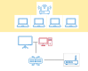
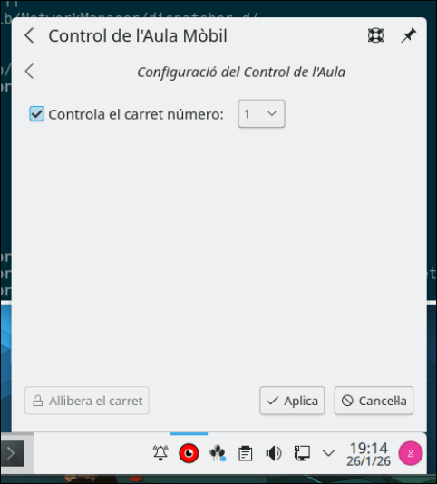
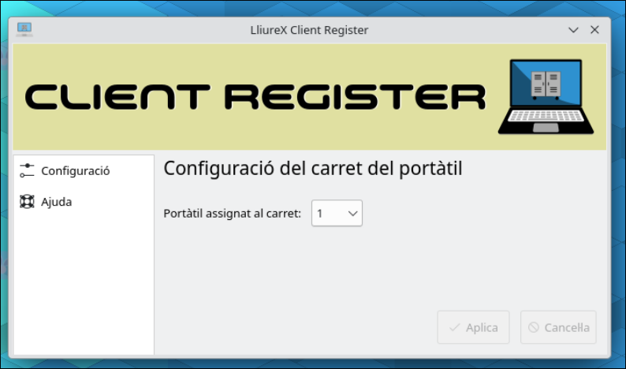
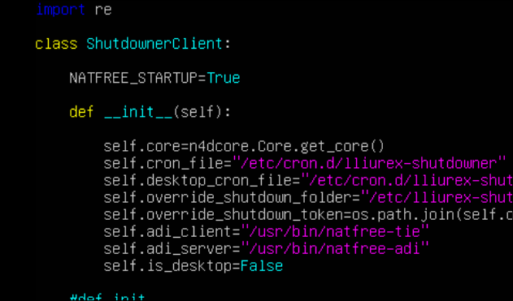

# Aula
## Descripcion del aula

 
El aula esta formada por un equipo del profesor (ADI) que esta conectado a la vlan 40 del centro. Normalmente esta acompañada por un panel tactil el cual tambien esta conectado a la misma vlan 40. 

Los alumnos utilizaran unos portatiles que podran estar en el aula o bien en un carrito para compartir esos equipos entre varias aulas. Los portatiles estaran conectados a la wifi.

## Metapaquetes

Los metapaquetes que deberan estar instalados en cada equipo son:
* Equipo del profesor (ADI):
  * lliurex-meta-adi
  * lliurex-meta-gva
* Equipo del alumno (portatil):
  * lliurex-meta-wifi-alu
  * lliurex-meta-gva

## Etiquetas de autoupgrade

Las etiquetas de autoupgrade que deberan tener los equipos son:
* Equipo del profesor (ADI):
  * adi
  * gva
* Equipo del alumno (portatil):
  * wifi-alu
  * gva

## Funcionamiento del aula natfree
### Equipo del profesor (ADI)
 * El equipo estara conectado por cable de red.
 * Se crea la interfaz natfree00 mediante un Descripcionript de dispatcher.d del NetworkManager.
 * El profesor tomara el control del aula mediante el controlador de carritos, indicando cual es el carrito que quiere controlar. 

 

 * Esto ejecutara natfree-adi configure X, donde X es el numero del carrito. 
   * En base a la configuracion del fichero /etc/natfree.d/ y buscando la variable NF_DEF_IP_NUMBER, obtendra la ip que ha de configurarse en la interfaz natfree00. Segun el carrito que este controlando sumara un offset a la ip de la red y se asignara dicha ip. En el caso de controlar el carrito 1 se le asignara la 15 ip partiendo desde la base. Ese es el valor por defecto, pero se puede cambiar con el valor NF_DEF_IP_NUMBER. El ultimo carrito correspondera a la primera ip usable de la red en la que esta.
   * Actualizara el /etc/hosts y la ip calculada de carrito resolvera "server"
   * Configurara las variables CLASSROOM, SRV_IP, CLIENT_LDAP_URI y CLIENT_LDAP_URI_NOSSL
### Equipo del alumno (portatil)
  * El equipo inicialmente no estara conectado a ninguna red.
  * El equipo ha de haber sido registrado mediante la herramienta de registro de carrito "client register".
  
  * De forma habitual al inciar sesion se creara una conexion wifi mediante su usuario de identidad digital. Con usuarios locales no se creara la conexion wifi. Solo en el caso de usuario alumnat se conectara a la wifi XXX.
  * Durante la conexion tratara de obtener de la red el valor lliurex_vlan para conocer cual es la ip base de la red vlan40. De conseguirlo, creara la variable n4d LLIUREX_VLAN con dicho valor.
  * Se lanza el demonio sync-on-server-ready el cual estara comprobando si el servidor "server" responde.
     * Cuando server responda, ejecutara todo lo que exista en el directorio /usr/share/sync-on-server-ready/actions, entre los que se encuentra volver a disparar aquellos startups de n4d que tengan en su clase la variable NATFREE_STARTUP = True.
     
  * Se configura y recarga el servicio de monit para que este vigilando la ip que haya calculado que sera su servidor. Para este calculo se basara en los siguientes parametros:
    * Tengo la variable de n4d LLIUREX_VLAN con la ip base de la vlan40. Entonces utilizo esa ip base y le sumo un offset segun el carrito que soy basado en la variable NF_DEF_IP_NUMBER.
    * No he cumplido el caso anterior. Entonces busco la ip que he obtenido en la interfaz que se ha levantado con ip, obtengo la ip de la red a la que pertenezco y le sumo un offset segun el carrito que soy basado en la variable NF_DEF_IP_NUMBER.
  * Cuando monit detecte que el servidor responde, ejecutara el comando natfree-tie put x.x.x.x donde x.x.x.x es la direccion obtenida en el paso anterior.
  * Si monit detecta que el servidor deja de responder, ejecutara el comando natfree-tie destroy, el cual eliminara del /etc/hosts la entrada de server. 

