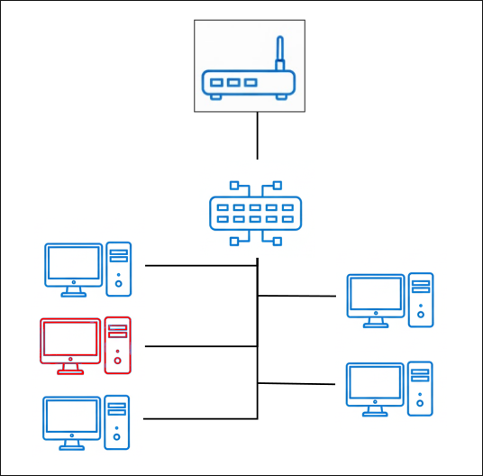

# Laboratorio
## Descripción del laboratorio

## Metapaquetes 

Los metapaquetes que deberán estar instalados en cada equipo son:
* Equipo del profesor:
  * lliurex-meta-lab-pro
  * lliurex-meta-gva:
* Equipo del alumno:
  * lliurex-meta-lab-alu
  * lliurex-meta-gva

## Etiquetas de autoupgrade
Las etiquetas de autoupgrade que deberán tener los equipos son:
* Equipo del profesor:
  * lab-pro
  * gva
* Equipo del alumno:
  * lab-alu
  * gva

## Funcionamiento del laboratorio natfree
El funcionamiento del laboratorio natfree es similar al del aula natfree, con las siguientes diferencias:
* El equipo del profesor no puede controlar carritos ya que esta en una vlan dedicada para el laboratorio, donde estan conectados ademas los equipos de los alumnos. Por esto mismo el equipo del profesor esta configurado automaticamente y controlara el carrito 1
* No tiene la herramienta de control de carritos instalada el equipo del profesor.
* Los equipos de los alumnos estan configurados automaticamente como carrito 1, ya que no pueden ser movidos a otras aulas. Y en caso de moverse a esas otro laboratorio estaran en una vlan diferente. Esta configuracion viene dada por tener instalado el metapaquete lliurex-meta-lab-alu.
* No tienen las herramientas de indicador de carrito ni de registro de carritos los equipos de los alumnos. 
