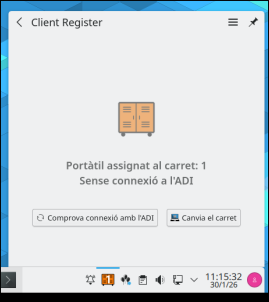
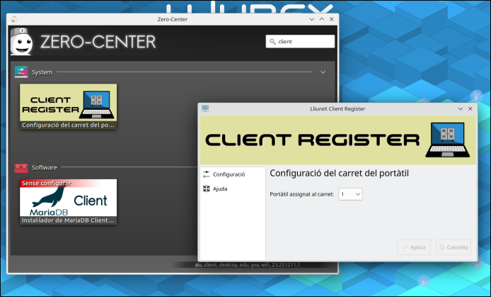

# Utilidades
## Indicador de carrito y estado

El indicador de carrito indica a que carrito perteneces y el estado de conexion con el servidor. Se puede presionar el boton de comprobar el estado del servidor para forzar una comprobacion inmediata. Tambien se puede presionar el boton de cambiar el carrito para cambiar el carrito al que se pertenece. Esta ultima opcion lanzara la utilidad de registrador de carrito.
## Registrador de carrito

El registrador de carrito permite registrar el equipo en un carrito concreto. Solo permite alcanzar un numero maximo de carrito definido por la variable NF_DEF_IP_NUMBER.

## Controlador de carritos

Utilidad para controlar un carrito. El comando que ejecuta por debajo es natfree-adi configure/unconfigure X , donde X es el numero del carrito a controlar. Se apoya en la variable CLASSROOM para saber que aula esta controlando.

## Linea de comandos
### nfctl 
Utilidad de linea de comandos que actualmente se usa para obtener informacion del entorno natfree. Puedes obtener las variables internas de natfree o valores calculados como la ip de red de aula natfree ( util para cluster-ssh ) 
